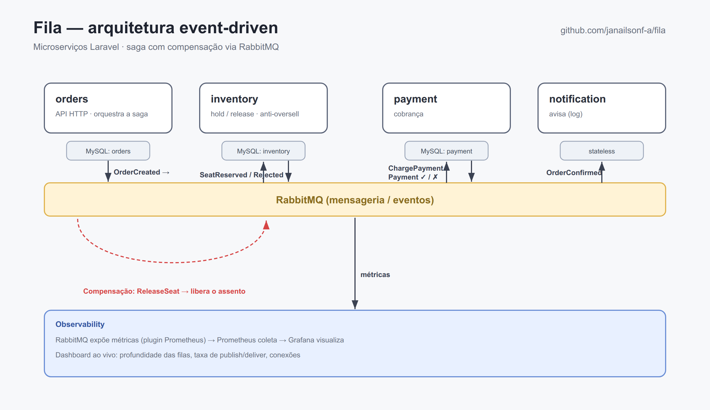
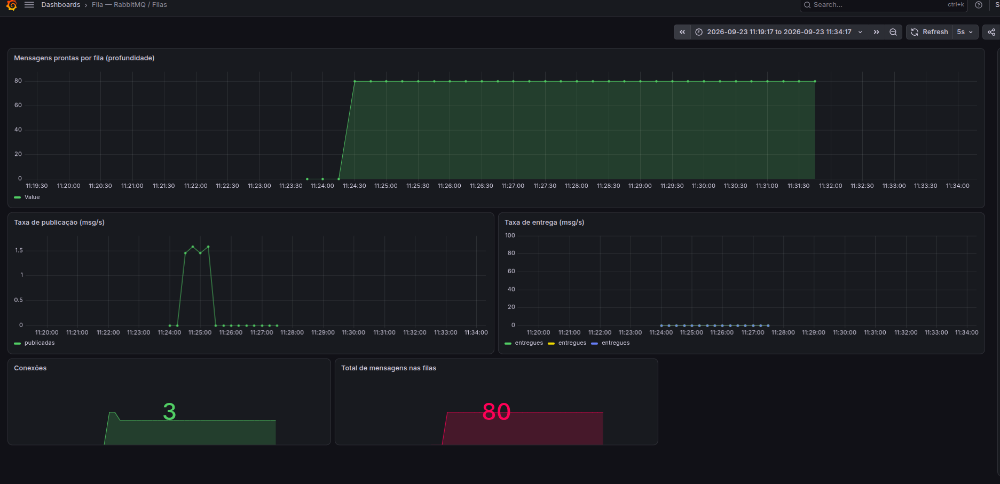

# Fila 🎟️

[](https://github.com/janailsonf-a/fila/actions/workflows/ci.yml)


Plataforma de venda de ingressos construída como **microserviços event-driven** —
um estudo de arquitetura, concorrência e DevOps de ponta a ponta.

O problema que dá sentido a tudo: **reserva de assento com concorrência**. Dois
compradores não podem levar a mesma poltrona. Isso exige controle de concorrência
real (lock pessimista), reserva temporária (*hold*) e **compensação** quando o
pagamento falha.



## ✨ Destaques

- **Saga com compensação** orquestrada — pagamento falhou → assento é devolvido ao estoque
- **Anti-overselling** com lock pessimista (`lockForUpdate`) sob concorrência
- **Um banco por serviço** (database-per-service) — acoplamento baixo
- **Infra como código** (Terraform) + **CI/CD** com GitHub Actions e **OIDC (sem secrets)**
- **CD staging → production com aprovação manual**
- **Observability**: Prometheus + Grafana com métricas do RabbitMQ ao vivo
- Testado ponta a ponta **na nuvem (Azure)**

## 🏗️ Arquitetura

Quatro serviços Laravel conversando por eventos via RabbitMQ. O `orders` é o
**orquestrador da saga**:

```
POST /orders → PENDING → OrderCreated → [inventory]
inventory: hold do assento (anti-oversell)
    livre → SeatReserved → [orders] → RESERVED → ChargePayment → [payment]
    ocupado → SeatRejected → [orders] → REJECTED
payment: cobra
    ok → PaymentConfirmed → [orders] → CONFIRMED → OrderConfirmed → [notification]
    falha → PaymentFailed → [orders] → PAYMENT_FAILED → ReleaseSeat → [inventory]  ← COMPENSAÇÃO
```

| Serviço | Papel | Estado |
|---------|-------|--------|
| `orders` | API HTTP + worker; orquestra a saga | MySQL |
| `inventory` | hold / release de assento; anti-oversell | MySQL |
| `payment` | cobrança (mock) | MySQL |
| `notification` | notificação (log) | stateless |

## 🚀 Rodar local

```sh
docker compose up --build
```

- API: http://localhost:8080
- RabbitMQ UI: http://localhost:15672 (fila / fila)
- Grafana: http://localhost:3000 · Prometheus: http://localhost:9090

### Testar a saga

```sh
# caminho feliz → CONFIRMED
curl -s -X POST http://localhost:8080/api/orders -H 'Content-Type: application/json' \
  -d '{"session_id":"show-1","seat_id":"A1","user_id":"u1"}'

# mesmo assento de novo → REJECTED / TAKEN (anti-oversell)
# pagamento falha (user começa com "fail") → PAYMENT_FAILED + assento liberado
curl -s -X POST http://localhost:8080/api/orders -H 'Content-Type: application/json' \
  -d '{"session_id":"show-1","seat_id":"A2","user_id":"failuser"}'
```

## 📊 Observability

Dashboard Grafana provisionado com métricas do RabbitMQ — dá pra ver as mensagens
fluindo pelas filas ao vivo (e uma fila enchendo quando um worker cai, o sinal que
o KEDA usaria pra escalar):



## 🧰 Stack

**App:** Laravel 13 · PHP 8.3 · RabbitMQ · MySQL 8
**DevOps:** Docker / Compose · Terraform · GitHub Actions (OIDC) · Prometheus · Grafana · Azure

## ☁️ Deploy (Azure)

Toda a infra é Terraform ([`infra/`](infra)) e o pipeline em
[`.github/workflows`](.github/workflows) — ver [`docs/CICD.md`](docs/CICD.md).

- [`infra/terraform`](infra/terraform) — caminho gerenciado (ACR, Container Apps + KEDA, MySQL Flexible, Key Vault)
- [`infra/vm`](infra/vm) — deploy por VM + docker-compose (o que roda na Azure for Students)

> **Nota (Azure for Students):** o Container Apps da conta é *express* (sem TCP
> ingress) e o MySQL gerenciado não tem capacidade nas regiões liberadas. Por isso
> o deploy que roda de fato é por **VM** — o IaC do caminho gerenciado fica pronto
> para uma assinatura padrão. Diagnóstico completo em `docs/CICD.md` e no histórico.

## 🗺️ Roadmap

- [x] 1 · Serviços + mensageria local
- [x] 2 · Saga completa com compensação
- [x] 3 · IaC (Terraform)
- [x] 4 · CI + OIDC
- [x] 5 · Deploy na Azure
- [x] 6 · CD staging → production (aprovação manual)
- [x] 7 · Observability (Prometheus + Grafana)
- [x] 8 · Polish
- [ ] Frontend (Next.js)

## 📄 Licença

MIT.
